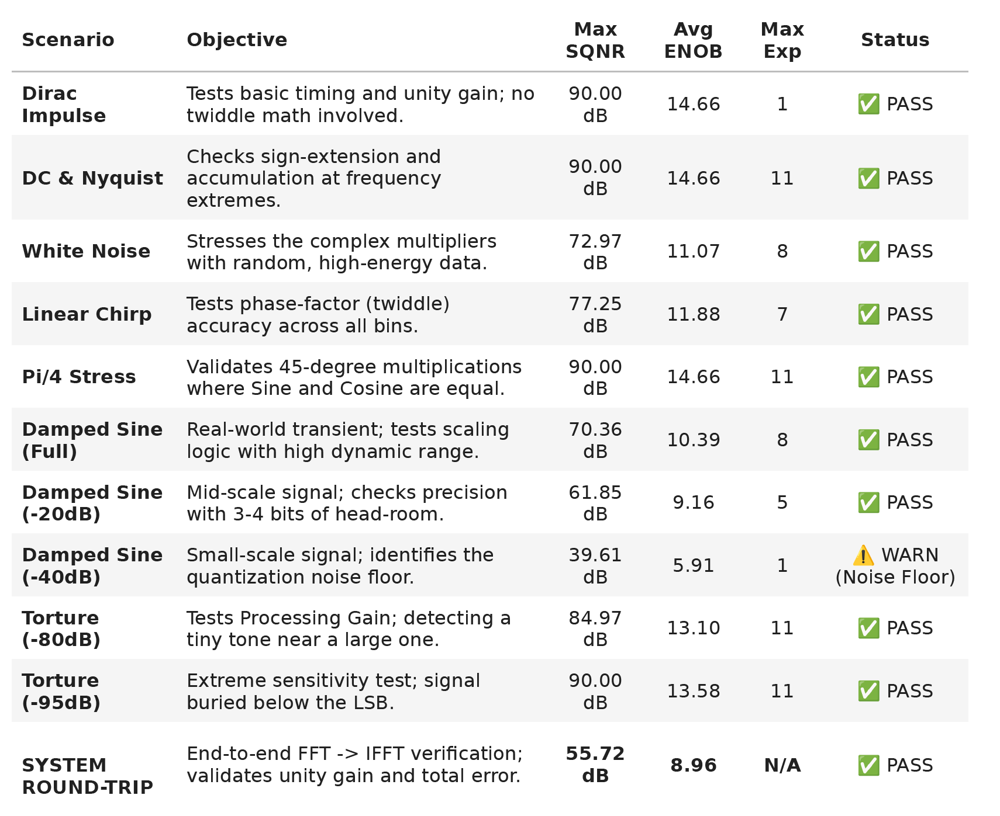

# Fixed-Point FFT Core (VHDL)
[](https://github.com/HaraldFjellstrom/VHDL_FFT/actions/workflows/verification_report.yml)

A parameterizable Fast Fourier Transform (FFT) implementation developed for the **AGSTU VHDL 2** digital design course. This project demonstrates a Python-driven RTL verification flow, bridging VHDL implementation with high-level signal analysis and automated CI/CD reporting.

<p align="center">
  
  <br>
  <b>Figure 1:</b> <em>Sample metrics table extracted from the automatically generated verification report.</em>
</p>

## Key Features
* **Parameterizable Architecture:** Configurable FFT/IFFT length using Q1.14 fixed-point arithmetic via VHDL generics.
* **Python-Driven Verification:** Integration of `cocotb` and `nvc` for rigorous design verification.
* **Automated Reporting:** A custom GitHub Actions pipeline executes simulations on every push, generating a timestamped PDF report containing SQNR, ENOB, and signal reconstruction analysis (examples in `docs/reports/`).. 
* **Fixed-Point Analysis:** Built-in tools for quantifying quantization noise and validating bit-accurate behavior.

> [!IMPORTANT]
> **Implementation Scope:** This project is a **Design Verification (DV)** suite. The RTL is optimized for algorithmic correctness and architectural validation within a simulation environment; it has not been technology-mapped for hardware synthesis.

## Prerequisites
* **OS:** Linux or WSL2.
* **VHDL Simulator:** [NVC](https://github.com/nickg/nvc).
* **Environment:** Python 3.10+ with `venv`.

## Getting Started

### 1. Clone the Repository
```bash
git clone https://github.com/HaraldFjellstrom/VHDL_FFT.git
cd VHDL_FFT
```

### 2. Initialize Environment
The setup script automates the creation of a Python virtual environment and installs the required python packages.

```bash
source setup_env.sh
```

### 3. Run Interactive Analysis
The project includes a Jupyter-based analysis suite that serves as both a development playground and a verification engine. 

To launch the environment:
```bash
jupyter lab notebooks/Verification_Report.ipynb
```

**Within the notebook, you can:**

* **Modify Hardware Generics:** Test different FFT point sizes ($N$) on the fly to evaluate hardware resource trade-offs.
* **Visualize Results:** Generate plots for **SQNR** (Signal-to-Quantization-Noise Ratio) and **ENOB** (Effective Number of Bits) to quantify precision loss.
* **Debug Bit-Accuracy:** Compare the VHDL fixed-point output against a double-precision NumPy reference to identify potential overflow, saturation, or rounding issues.

## Verification Methodology

The project utilizes a software-based verification suite to ensure the bit-accuracy of the VHDL implementation:

* **Stimulus Generation:** High-level test vectors (Harmonics, Impulses, and White Noise) are generated using **NumPy** to provide a wide range of spectral coverage.
* **Co-Simulation Flow:** Data is transferred between the Python test environment and the VHDL testbench via binary files. This process is abstracted through the `fft_utils` library, allowing for seamless data flow between the high-level model and the RTL.
* **Automated Regression:** To validate the design's parameterizable nature, the pipeline forces a clean re-compilation of the VHDL source for every configuration. This ensures that **generics** (such as FFT length and scaling thresholds) are correctly applied and verified across the full regression suite.
* **Metrics & Analysis:** The hardware output is compared against a floating-point reference model to calculate key performance indicators:
    * **SQNR / ENOB:** Quantifies the noise floor introduced by fixed-point arithmetic.
    * **Roundtrip Analysis:** Validates the IFFT(FFT(x)) chain to ensure signal reconstruction integrity.

## Project Structure

The repository is organized to separate the hardware implementation from the verification and documentation layers:

* **`rtl/`**: Contains the VHDL source files for the FFT core, including the butterfly units and address generation logic.
* **`sim/`**: Includes the `cocotb` testbenches, simulation makefiles, and raw simulation results.
* **`notebooks/`**: Jupyter notebooks and Python helper library used for regression execution, data visualization, and automated report generation.
* **`docs/`**: Contains the final architecture documentation, verification reports and other documents.
